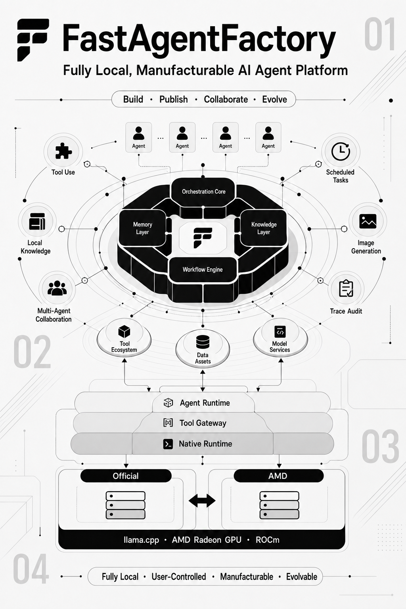

# FastAgentFactory

> A collaborative AI assistant built on a multi-Agent platform.

FastAgentFactory unifies conversation, task decomposition, Agent orchestration, tool execution, knowledge retrieval, long-term memory, workspaces, and deliverables in one auditable collaboration platform. The primary Agent may complete work directly, invoke existing specialists, manufacture new Agents, or evolve published Agents, then review and deliver the results of multiple execution chains through one conversation.

The platform supports local Linux/ROCm deployment and split-host deployment, where a macOS, Windows, or Linux control host connects to a remote AMD Radeon inference node over SSH. AgentPackages run as host-supervised native subprocesses. Independent workspaces, isolated runtime directories, and shared read-only dependency pools provide logical isolation without Docker.



## Start Here

Choose a path according to what you want to do:

| Goal | Recommended path |
| --- | --- |
| Understand the product | [Platform Positioning](#platform-positioning) → [Core Capabilities](#core-capabilities) → [Demo Video](#demo-video) |
| Deploy and run it | [Runtime Architecture](#runtime-architecture) → [Requirements](#requirements) → [One-command Deployment](#one-command-deployment) |
| Use Agents | [First Run](#first-run) → [Feature Guide](#feature-guide) |
| Review AMD optimizations | [AMD Radeon Inference Optimization](#amd-radeon-inference-optimization) → [Benchmarking and Operator Analysis](#benchmarking-and-operator-analysis) |
| Develop or verify the project | [Repository Layout](#repository-layout) → [Development and Static Validation](#development-and-static-validation) → [Detailed Documentation](#detailed-documentation) |

## Platform Positioning

FastAgentFactory is neither a collection of disconnected chat windows nor a system that forces every request through a child Agent. The primary Agent is the unified entry point and dynamically chooses how to act according to task complexity and available capacity:

1. Complete straightforward work directly.
2. Create a background task and delegate it when an existing specialist is suitable.
3. Run multiple Agents asynchronously for cross-domain work while continuing to receive and interpret user messages.
4. Start manufacturing when the required capability does not yet exist.
5. Start evolution when a published Agent needs to be improved and revalidated.

The user sees one continuous interaction rather than separate pages for internal runtime modes. Task chains, participating Agents, tool calls, approvals, failures, pauses, external waits, and deliverables are projected into the frontend through one runtime protocol.

## Core Capabilities

### Primary Agent and Asynchronous Multi-Agent Collaboration

- The primary Agent can use tools directly or create and orchestrate child-Agent tasks.
- Every Agent has its own session and runtime state; unauthorized context is not shared.
- Background tasks expose queueing, capacity admission, leases, heartbeats, cancellation, recovery, and delivery states.
- Messages sent while work is running are queued. On the next turn, the primary Agent decides whether they supplement, redirect, stop, or continue current work.
- Multi-Agent collaboration uses isolated task workspaces. Agent group chat can give independent Agent sessions access to the same locally linked directory.

### Agent Manufacturing and Evolution

- Describe the Agent's purpose, boundaries, and acceptance criteria in natural language.
- Generate identity, model contracts, tools, Skills, MCP bindings, knowledge, and runtime patterns from the requirement.
- Require a real Probe for tool implementations, with observable dependency initialization, standard output, failure stage, and final result.
- Enter a pending-publication state only after complete static validation, then ask the user to confirm publication in the floating task card.
- Reuse the same authoring, probe, validation, and publication state machine for evolution.

### AgentPackage Runtime

An AgentPackage is the platform's publishable capability unit. It describes:

- Agent identity and runtime pattern.
- Model-role bindings and permitted overrides.
- Tools, risk levels, approval policy, concurrency semantics, and output-compaction policy.
- MCP, Skill, and knowledge-base bindings.
- Context, cross-session memory, and compression policy.
- Scheduler defaults for timezone, concurrency, timeout, unattended approval, and failure-based suspension.

Published packages do not contain user model credentials, Resource secrets, chat history, attachments, or runtime checkpoints. After downloading an external Agent package, the user must select and bind locally available models.

### Workspaces and File Delivery

- A new session can use an isolated platform-managed workspace or link an existing local directory.
- Linking does not copy the source directory and can be removed at any time.
- Multiple sessions may use the same linked workspace while each Agent retains independent conversation state.
- Attachments, knowledge materials, images, and generated files can be browsed and opened from the workspace.
- File creation, editing, movement, copying, and deletion use structured tools or a controlled Shell, with tool records preserved.

### Extensions, Knowledge, and Memory

- MCP servers and Skills are configured once in a global registry, then bound to individual Agents.
- MCP supports stdio and network transports, environment variables, headers, timeouts, and default tool-risk settings.
- A Skill may contain `SKILL.md`, scripts, templates, and other resources rather than only a prompt fragment.
- Knowledge bases support file ingestion, chunking, Embedding, retrieval, opening, and source citation.
- Cross-session memory distinguishes workspace scope from global scope and is retrieved according to the current session.
- Context compression follows the selected model profile by default and may be overridden by an AgentPackage.

### Scheduling, Approval, and Observability

- Scheduled tasks support timezone, concurrency policy, timeout, failure counts, and automatic suspension.
- Tool approval, user questions, resource requests, and publication confirmation share the same floating task-card surface.
- Auto mode follows tool permissions for automatic approval and lets the primary Agent communicate with child Agents automatically.
- Traces retain model streams, tool calls, stages, tokens, cache activity, task state, and error summaries.
- Tool duration updates while the tool is running, and image-tool results can be rendered directly in messages.

## Typical Use Cases

### Office Deliverables

The user provides a topic, attachments, and style requirements. The primary Agent uses search, knowledge, and file tools, delegates to a document or presentation Agent when useful, and writes editable deliverables to the current workspace.

### Complex Research

The primary Agent decomposes one goal into evidence tasks and runs different specialists in parallel. Each task returns sources, timestamps, and artifacts. The primary Agent performs semantic acceptance, resolves conflicts, and produces the final synthesis.

### Recurring Work

An Agent creates a one-time or recurring Scheduler task to produce briefs, reminders, or files within the unattended-approval boundary. External actions requiring approval cannot bypass their permission policy.

### Built-in U.S. Equity Multi-Agent Demonstration

The repository includes three U.S. equity specialist Agents that demonstrate real data tools, multi-Agent collaboration, and delivery:

| Agent | Responsibility | Typical deliverable |
| --- | --- | --- |
| U.S. Equity Market Radar | Major indexes, leading/declining equities, and most-active names | Market brief, anomaly notes, Markdown report, and authorized email |
| U.S. Listed Company Researcher | Yahoo Finance market data, SEC company facts, trends, and user materials | Company research report with sources and data timestamps |
| U.S. Equity Portfolio Risk Guard | Concentration, volatility, drawdown, S&P 500 beta, correlation, and stress scenarios | Portfolio risk report and scenario analysis |

The primary Agent can research the market and several companies concurrently, then evaluate a simulated portfolio under `5%` and `10%` drawdowns and produce one delivery. All financial output is for research and system demonstration only and is not investment advice.

## Runtime Architecture

```text
Control host (macOS / Windows / Linux)
┌────────────────────────────────────────────────────────────┐
│ Browser :3000                                              │
│   │ HTTP + SSE                                             │
│ FastAgentFactory Backend :8000                             │
│   ├─ Primary Agent / background tasks / Agent orchestration│
│   ├─ AgentPackage / RuntimeKernel / Tool Gateway           │
│   ├─ Model Pool / Knowledge / Memory / Scheduler           │
│   ├─ Workspace / Trace / Approval / Artifact               │
│   └─ Native Agent Runtime / isolated session workspaces    │
│                                                            │
│ Local loopback or SSH tunnels                              │
│   18003 -> inference 8003  direct llama.cpp diagnostics   │
│   18002 -> inference 8002  Embedding API                  │
│   18004 -> inference 8004  admission, control, telemetry  │
│   18005 -> inference 8005  Image Generation API           │
└──────────────────────────────┬─────────────────────────────┘
                               │ SSH key only
AMD ROCm inference node        ▼
┌────────────────────────────────────────────────────────────┐
│ FastAgentFactory Inference Control :8004                   │
│   ├─ cross-session fairness / priority / queue / cancel   │
│   ├─ llama-server ROCm :8003                              │
│   ├─ SentenceTransformers + PyTorch HIP :8002             │
│   ├─ stable-diffusion.cpp HIPBLAS :8005                   │
│   └─ GPU / VRAM / model lifecycle / benchmark telemetry   │
│                                                            │
│ official + AMD llama.cpp source / build / active link      │
│ GGUF + mmproj + bge-m3 + FLUX model files                  │
└────────────────────────────────────────────────────────────┘
```

Two deployment topologies share the same behavior:

- `DEPLOY_TARGET=local`: Web, Agent Runtime, and AMD inference run on the same Linux/ROCm host and communicate over loopback.
- `DEPLOY_TARGET=ssh`: Web and Agent Runtime run on the control host, while the AMD inference node runs on remote Linux and exposes loopback services through SSH tunnels.

Both topologies reuse the same model profiles, Agent runtime chain, capacity scheduler, Official/AMD switching, and benchmarks. There is no feature-reduced remote branch.

## Default Models

The first deployment uses the following stack. Override it through the root `.env` or the model configuration page:

| Purpose | Model | Download source | Default configuration |
| --- | --- | --- | --- |
| Chat | `Qwen3.6-35B-A3B-APEX-I-Quality.gguf` | Hugging Face mirror with resume and SHA256 validation | 256K Context, Q8_0 KV, Flash Attention, 3 slots, fair admission, GPU Layers 99 |
| Vision projector | Matching `mmproj-...-APEX-F16.gguf` | Hugging Face mirror | Loaded with the Chat profile |
| Embedding | `BAAI/bge-m3` | ModelScope | 1024 dimensions, normalized, PyTorch HIP |
| Image | `FLUX.1-dev Q4_0` + VAE + CLIP-L + T5XXL | ModelScope direct links | stable-diffusion.cpp HIPBLAS, 1024×1024, 20 steps, eager load |

The Chat GGUF is approximately `23.5 GB`, the vision projector approximately `0.9 GB`, and the FLUX files approximately `16.3 GB`. Reserve additional space for Embedding, native builds, and runtime state.

## Requirements

### Control Host

- macOS, Linux, or Windows 10/11.
- Git.
- OpenSSH: `ssh` and `scp`.
- Python 3.11+.
- [uv](https://docs.astral.sh/uv/).
- Node.js 18+ and npm.

Remote SSH deployment prefers incremental `rsync` on macOS/Linux. Windows uses OpenSSH, SCP, and compressed archives for the same synchronization boundary and does not require WSL, Git Bash, or Docker. Only local Linux ROCm deployment requires `rsync`.

### AMD ROCm Inference Node

- Linux and a working AMD Radeon GPU.
- ROCm user-space runtime and compiler components.
- Access to `/dev/kfd`.
- PyTorch HIP compatible with the installed ROCm version.
- SSH-key login in SSH mode.

The deployment scripts prepare ordinary build tools such as CMake, Ninja, curl, and a compiler only when missing. They do not upgrade or reinstall the GPU driver.

> **Server image tip:** On RadeonCloud or AMD cloud infrastructure, select `ROCm vLLM-dev (Navi) (vllm-dev:rocm7.2.1_navi_ubuntu22.04_py3.10_pytorch_2.9_vllm_0.16.0)`. Before using another image, verify ROCm, PyTorch HIP, `/dev/kfd`, and Python ABI compatibility.

## One-command Deployment

### 1. Get the Project

```bash
git clone https://github.com/LiuYan-89937/FastAgentFactory.git
cd FastAgentFactory
cp .env.example .env
```

On Windows PowerShell:

```powershell
Copy-Item .env.example .env
```

### 2. Configure a Remote AMD Inference Node

Set these fields in `.env`:

```dotenv
DEPLOY_TARGET=ssh
SSH_HOST=<AMD-Inference-Host>
SSH_PORT=<SSH-Port>
SSH_USER=root
SSH_KEY=~/.ssh/<private-key>
```

`SSH_KEY` may be an absolute private-key path or a path under `~/.ssh`. Leave it empty when ssh-agent or OpenSSH can select the correct key automatically.

Verify the command itself can log in:

```bash
ssh root@<AMD-Inference-Host> -p <SSH-Port>
```

For key generation, sshd checks, `authorized_keys` installation, and connection verification, see [Configure SSH Key Authentication from Scratch](project-documentation/Deployment.md#41-configure-ssh-key-authentication-from-scratch).

### 3. Configure a Local AMD Inference Node

When the AMD GPU is on the current Linux host:

```dotenv
DEPLOY_TARGET=local
SSH_HOST=
SSH_PORT=22
SSH_USER=
SSH_KEY=
```

Set `REMOTE_PROJECT_ROOT`, `REMOTE_STATE_ROOT`, `REMOTE_MODEL_ROOT`, `REMOTE_LLAMA_SOURCE_ROOT`, `REMOTE_LLAMA_RUNTIME_ROOT`, and `REMOTE_STABLE_DIFFUSION_CPP_DIR` to writable absolute local paths. The `REMOTE_` prefix consistently means “inference-node path” in both deployment modes.

### 4. Start

On macOS or Linux:

```bash
./deploy.sh up
```

On Windows PowerShell:

```powershell
Set-ExecutionPolicy -Scope Process Bypass
.\deploy.ps1 up
```

Open the application at:

```text
http://localhost:3000
```

Successful startup prints `Backend is ready`, `Frontend is ready`, and `Application ready`. The backend uses port `8000`; the frontend development server uses port `3000` with HMR.

### What the Deployment Script Does

The first `up` follows one idempotent workflow:

1. Validate the target, including key-based SSH login or the local Linux/ROCm environment.
2. Validate the bundled Official and AMD llama.cpp trees; do not fetch llama.cpp online.
3. Inspect GPU, VRAM, disk, `/dev/kfd`, ROCm, and PyTorch HIP.
4. Prepare ordinary build tools and ROCm user-space components only when missing and permitted.
5. Check the HTTPS CA chain for domestic model mirrors and repair it only when broken.
6. Synchronize the minimal inference-control bundle and three complete native inference source trees; reuse them directly when local paths coincide.
7. Build Official and AMD `llama-server` / `llama-bench` plus the HIPBLAS `sd-server` independently.
8. Resume Chat GGUF and mmproj downloads and validate SHA256.
9. Download or reuse `BAAI/bge-m3` from ModelScope.
10. Download and validate FLUX, VAE, CLIP-L, and T5XXL.
11. Idempotently synchronize Chat, Embedding, and Image profiles on the inference and control hosts.
12. Start the inference node and wait for every enabled model to become `ready`.
13. Create loopback SSH tunnels in SSH mode or connect directly in local mode.
14. Prepare control-host dependencies from `uv.lock` and `package-lock.json`, then start the backend and frontend.

Large model downloads are resumable. Files that already pass validation are not downloaded again.

## Deployment Commands

Use `.\deploy.ps1` instead of `./deploy.sh` on Windows PowerShell; arguments are the same.

| Command | Purpose |
| --- | --- |
| `./deploy.sh up` | Idempotently deploy inference and start Web; create tunnels in SSH mode |
| `./deploy.sh up --no-web` | Deploy inference without starting frontend or backend |
| `./deploy.sh bootstrap` | Prepare models and inference services without starting Web |
| `./deploy.sh doctor` | Inspect GPU, ROCm, PyTorch HIP, disk, and llama.cpp |
| `./deploy.sh status` | Show inference-node, model, and software-version status |
| `./deploy.sh logs` | Show the most recent 200 lines of inference logs |
| `./deploy.sh restart` | Restart inference and wait for model readiness |
| `./deploy.sh down` | Stop inference and release VRAM |
| `./deploy.sh models` | Resume and validate model downloads, then refresh profiles |
| `./deploy.sh sync` | Synchronize the minimal inference bundle and native sources |
| `./deploy.sh build-llama [official\|amd\|all]` | Incrementally build selected implementations |
| `./deploy.sh switch-llama <official\|amd>` | Switch the active implementation under the same profile |
| `./deploy.sh list-llama-builds` | Show source revisions, summaries, and binary SHA256 values |
| `./deploy.sh rollback-llama` | Restore the previous active implementation |
| `./deploy.sh build-sd` | Synchronize and incrementally build stable-diffusion.cpp |

When changing instances, update the SSH host and port. When persistent-disk locations change, update model, state, llama.cpp source/build, and stable-diffusion.cpp paths together.

## First Run

1. Open **Model Configuration** and confirm that Chat, Embedding, and enabled Image profiles are `ready`.
2. Open **Published Agents** and initialize the built-in Agents you plan to use.
3. Initialize **Factory Chat** before regular conversation.
4. Initialize all three U.S. equity specialists before running their collaboration demonstration.
5. When creating a session, choose an isolated workspace or link a local directory.

Initialization prepares the AgentPackage runtime, tools, and dependencies, so the first run is normally slower than subsequent sessions. If a message is sent before Factory Chat is ready, the platform begins initialization automatically and then transitions to normal streamed output.

`deploy.sh up` remains in the foreground. `Ctrl+C` stops the frontend, backend, and SSH tunnel but leaves the remote inference node running. Run `./deploy.sh down` to release its VRAM.

## Feature Guide

### Model Configuration

The model page can:

- Show AMD GPU, ROCm, PyTorch HIP, VRAM, and GPU utilization.
- Show load stages, logs, and effective profile parameters for Chat, Embedding, and Image.
- Load, unload, and restart models.
- Set default `main`, `task`, `compression`, and `embedding` profiles.
- Configure Context, maximum output, temperature, compression threshold, GPU Layers, KV Cache, concurrency, and Flash Attention.
- Declare native context, YaRN support, and maximum extended context.
- Estimate VRAM from GGUF metadata, Context, concurrency, and KV Cache.
- Configure FLUX dimensions, steps, CFG, Diffusion Flash Attention, CPU text encoders, and residency.

Saving a loaded external profile forwards the new configuration to the inference node and restarts the corresponding runtime. A Context above the model's native limit reaches `llama-server` only when the profile declares YaRN support and stays below the configured extended limit.

### Conversation, Tools, and Workspaces

Use a conversation to verify:

1. Streamed output for ordinary messages.
2. Structured Tool Calling for files, Shell, knowledge, and MCP.
3. Live tool duration, arguments, output, and approval cards.
4. Real-time workspace refresh, preview, and opening.
5. Token, Context, compression, and KV Prefix Cache metrics.

Tools execute from the workspace root, so Shell commands do not need to `cd` on every call. Messages sent during execution enter the session queue and do not incorrectly interrupt other sessions.

### MCP and Skills

The Hackson test deployment includes Tavily Web Search MCP. `deploy.sh up` installs it under `.agentfactory/mcp/web_search`, builds it, registers it globally, and binds it to built-in Agents.

The shared key is intended only for competition demonstration and may be constrained by shared quotas. AgentPackage artifacts preserve only MCP binding relationships and do not embed private test MCP configuration.

The Extensions page lets users register MCP servers and Skills once, then drag their cards onto target Agents. A Skill may contain a complete directory and is not limited to a single `SKILL.md`.

### Knowledge Bases and RAG

The standard flow is:

1. Create a knowledge source and upload files from the knowledge-base entry point.
2. Wait for parsing, chunking, and Embedding.
3. Bind the source to an Agent.
4. Ask a question that needs internal material or source citations.
5. Inspect retrieval, opening, reading, and cited sources in Trace.

Conversation tools can also add knowledge and override chunking settings through advanced parameters. When retrieval returns no result, the Agent must not fabricate content from the source.

### Local Image Generation

FLUX.1-dev Q4_0 is served by remote `sd-server` through an OpenAI-compatible Images API. Results are written to `images/` in the current workspace. Only paths and metadata enter model context; base64 payloads do not.

The Image profile is enabled and active by default. Deployment waits until FLUX is actually `ready`; set `IMAGE_ENABLED=0` to disable it or `IMAGE_EAGER_LOAD=0` to load it on first use.

FLUX.1-dev is governed by a Non-Commercial License. Review its permitted use before deployment or demonstration.

### Agent Manufacturing, Publication, and Evolution

A manufacturing request should state purpose, input boundaries, target tasks, and acceptance criteria. The manufacturing Agent will:

1. Analyze intent and tasks.
2. Select React or Plan-and-Execute.
3. Generate Agent identity, model contract, and Context.
4. Assemble MCP, Skills, knowledge, Resources, and Scheduler settings.
5. Implement tools and execute real Probes.
6. Complete static validation.
7. Wait for publication confirmation in the floating task card.

After publication, the user can create an isolated session for the Agent. Evolution reuses the same validation and publication boundaries.

## AMD Radeon Inference Optimization

The repository directly vendors two llama.cpp trees from the same revision:

```text
vendor/llama.cpp-official/   pinned Official baseline; no project operator changes
vendor/llama.cpp-amd/        AMD RDNA3 HIP kernels and fused implementations
vendor/llama.cpp-common/     shared host-trace protocol
```

### Strongest Operator-level Result

Q8_0 × Q8_1 Native Wave32 MMVQ was independently ablated against the Official Q8 path inside the same AMD binary:

| Q8_0 regular Decode path | Calls | Total kernel time | Relative to Official |
| --- | ---: | ---: | ---: |
| Official | 5,120 | 38.775 ms | — |
| Native Wave32 | 5,120 | 20.507 ms | **-47.11%** |
| Native Wave64 | 5,120 | 22.450 ms | -42.10% |

`-47.11%` is an operator-profiler measurement of cumulative time for this kernel family. It is not an end-to-end service-throughput claim.

### End-to-end Result

Archived conditions: Qwen3.6-35B-A3B Q6_K, gfx1100, one concurrent client, 256K Context, Q8_0 KV, Flash Attention enabled, MTP disabled.

| Metric | Official | AMD implementation | Change |
| --- | ---: | ---: | ---: |
| Mean Decode throughput | 84.0867 tok/s | 88.8320 tok/s | **+5.64%** |
| Decode standard deviation | 0.1943 tok/s | 0.1718 tok/s | — |
| Mean Prompt time | 482.680 ms | 478.321 ms | -0.90% |
| Output tokens per run | 256 | 256 | same |
| Output hash | `6c7bf1…d473` | `6c7bf1…d473` | same |

With MTP enabled for both Official and AMD, Decode was effectively tied. AMD improved Prompt throughput by `16.70%`, reduced model-compute TTFT by `14.31%`, increased two-client QPS by `5.09%`, and reduced mean request latency by `4.89%`. Because MTP changes Decode scheduling in both implementations, MTP's own benefit is not attributed to AMD kernels.

### Implemented Optimizations

1. **Q8_1 activation-quantization reuse:** reuse the same F32 activation's Q8_1 temporary representation within one computation graph, reducing Decode Q8_1 calls by `42.74%`.
2. **Fused Residual RMSNorm:** combine Residual Add, RMSNorm, and scale in one RDNA3 HIP kernel to reduce launches and memory round trips.
3. **Native Q6_K MMVQ:** use one Wave32 per output row, remove cross-Wave LDS reduction, and share activation reads.
4. **Dynamic Q8 Wave32/Wave64 dispatch:** select variants using K, output rows, LDS, occupancy, and physical Wave width.
5. **Verifiable hits:** prove dispatch with the Kernel Catalog, Host Shape Trace, GGML graph, and `rocprofv3` timeline instead of inferring from names.

Implementation locations, per-round results, output consistency, and applicability boundaries are documented in [AMD Radeon GPU Inference Optimizations](project-documentation/performance/ROCmOptimizations.md). The archived measurements do not promise the same gains on other models, shapes, ROCm versions, or GPUs.

### Modify and Build AMD Kernels

Make operator changes only in the AMD tree:

```bash
cd vendor/llama.cpp-amd
# Modify ggml HIP dispatch and AMD kernels
```

Synchronize, build, and switch:

```bash
cd ../..
./deploy.sh sync
./deploy.sh build-llama amd
./deploy.sh switch-llama amd
```

Official and AMD use independent CMake/Ninja build directories and both produce `llama-server` and `llama-bench`. New kernels must be registered in the AMD Kernel Catalog and build manifest, then verified through operator analysis.

## Benchmarking and Operator Analysis

The performance page records:

- TTFT, Prompt Tokens/s, Decode Tokens/s, and end-to-end latency.
- Peak VRAM, mean/peak GPU utilization, and power.
- KV Prefix Cache reused tokens, computed tokens, and weighted reuse ratio.
- MTP candidate tokens, accepted tokens, and acceptance rate.
- Concurrent QPS, aggregate input/output TPS, error rate, TTFT P95, and request-latency P95.

Every experiment group alternates Official and AMD rounds. Both implementations use the same model file and profile. The control node switches binaries mutually exclusively, so two Chat models never occupy VRAM at the same time. Benchmark identity—implementation, source revision, source summary, and binary SHA256—is recorded automatically and cannot be entered manually.

### Normal Performance Tests

Normal tests keep the HIP Graph used by the production service. Their results support end-to-end throughput and latency claims. Prompt, output limit, Context, concurrency, and sampling parameters must be identical in every paired round.

### Operator Analysis

Operator analysis is isolated from normal performance tests:

1. Temporarily unload the Chat model.
2. Run `llama-bench` Prefill and Decode with the same profile parameters.
3. Set `GGML_CUDA_DISABLE_GRAPHS=1` only for the analysis subprocess to disable HIP Graph replay.
4. Use `GGML_SCHED_DEBUG=2` to record GGML graph operators and backends.
5. Use `rocprofv3` to aggregate kernel calls and duration.
6. Strictly pair host dispatch records with the GPU kernel timeline.
7. Restore the Chat model automatically when analysis completes.

A paired variant is displayed only when host-record and rocprof-event counts match exactly. A mismatch produces a warning rather than a guessed attribution. Profiler timing is used for attribution; real throughput comes from normal performance tests.

## Demo Video

<video
  controls
  preload="metadata"
  poster="supplementary-materials/poster/fastagentfactory-project-poster.png"
  width="100%"
>
  <source src="FastAgentFactory-Demo.mp4" type="video/mp4">
  This Markdown viewer does not support embedded video.
</video>

If the player is unavailable, [play or download the MP4 demo directly](FastAgentFactory-Demo.mp4).

The demonstration covers:

1. Primary-Agent conversation, tool calls, and workspace delivery.
2. Agent manufacturing, asynchronous background tasks, and publication confirmation.
3. Multi-Agent collaboration and specialist-result synthesis.
4. AMD Radeon inference-node, model-runtime, and capacity state.
5. Paired Official/AMD testing and operator-hit evidence.

Short tests in the video demonstrate the workflow and do not replace the repeated experiments in the performance documentation.

## Repository Layout

```text
agent_factory/                  Agent, RuntimeKernel, tools, knowledge, memory, scheduling
web_frontend/backend/           FastAPI Web backend
web_frontend/frontend/          Vue 3 frontend
SystemPackage/                  built-in AgentPackages
deploy/                         cross-platform deployment and inference control
vendor/llama.cpp-official/      Official baseline source
vendor/llama.cpp-amd/           AMD-optimized source
vendor/llama.cpp-common/        shared trace protocol
vendor/stable-diffusion.cpp/    image-inference source and submodules
project-documentation/          product, architecture, deployment, performance documentation
supplementary-materials/        poster and supplementary assets
```

## Configuration and Data Directories

### Control Host

```text
.env                         user deployment, SSH, and model configuration; not committed
deploy/defaults.env          versioned internal defaults; not a user-edited config file
.agentfactory/               model pool, extension registry, knowledge, memory, platform state
.agent_runtime/              session workspaces, traces, checkpoints, tool output
```

### Default Remote Inference Node

```text
/root/FastAgentFactory               minimal inference bundle
/root/.fastagentfactory              venv, model-pool SQLite, PIDs, logs
/root/models                         GGUF, mmproj, and ModelScope models
/root/fastagentfactory-llama-sources Official, AMD, and shared source
/root/.fastagentfactory/llama        builds, manifests, active symlink
/root/stable-diffusion.cpp           image-inference source and build
```

Whether `/root` persists depends on the instance type. When using persistent storage, override model, state, and build directories in `.env`. Back up benchmarks, profiles, traces, and operator changes before a temporary instance expires.

## Security Boundaries

- SSH uses key authentication; server passwords are not stored in configuration.
- `.env`, model files, Resource secrets, sessions, and runtime state are excluded from Git.
- Remote ports `8002`, `8003`, `8004`, and `8005` bind to `127.0.0.1` by default.
- `AGENTFACTORY_RESOURCE_MASTER_KEY` is generated on first deployment and written to local `.env`; encrypted resources cannot be recovered if it is lost.
- AgentPackages use supervised host subprocesses, independent workspaces, and shared dependency pools. This is logical isolation, not a kernel security sandbox.
- Deployment scripts do not install or upgrade the GPU driver; `/dev/kfd` must be provided by the host.
- Before AgentHub upload, Skill content and MCP JSON are shown for user review. Chat history, attachments, runtime state, and Resource values are excluded from public packages.

## Troubleshooting

### SSH Login Failure

```bash
ssh -vvv root@<host> -p <port>
```

Confirm that sshd is running, key login is enabled, host and port are correct, and the server public key matches the local private key.

`channel ... open failed: connect failed: Connection refused` means SSH connected but the remote inference service is not listening. Run:

```bash
./deploy.sh status
./deploy.sh logs
./deploy.sh restart
```

### ReadTimeout

Identify the timed-out URL first:

- `/models`: a model may still be parsing or loading.
- `/v1/chat/completions`: inspect model loading, Context, GPU execution, and the slot queue.
- `18004`: inspect the Telemetry tunnel and inference-control process.

```bash
./deploy.sh status
./deploy.sh logs
```

### Interrupted Model Download

```bash
./deploy.sh models
```

GGUF downloads resume and receive a verified marker only after SHA256 succeeds. Embedding and image models reuse the ModelScope cache.

### Model Load Failure or Insufficient VRAM

```bash
./deploy.sh doctor
./deploy.sh logs
```

Reduce Context, concurrency, KV Cache precision, or GPU Layers in Model Configuration. Saving a loaded profile restarts the remote model with the new parameters.

### Agent Runtime Initialization Failure

Check control-host Python, uv, package dependencies, workspace permissions, and dependency-pool logs, then rerun `./deploy.sh up`. Native Runtime does not depend on Docker.

### Frontend or Backend Not Ready

Inspect:

```text
.agentfactory/logs/web-backend.log
.agentfactory/logs/web-frontend.log
```

Changing client ports in access logs are temporary browser source ports; the backend listener remains fixed at `8000`.

## Development and Static Validation

Project policy avoids specialized Agent business examples in committed validation scripts. Use syntax and static checks:

```bash
python3 -m compileall -q agent_factory web_frontend/backend deploy
bash -n deploy.sh deploy/start_web.sh deploy/remote_runtime.sh
git diff --check
```

Frontend validation:

```bash
cd web_frontend/frontend
npm run type-check
```

Operator changes require independent builds and paired benchmarks. A single short run does not replace archived measurements.

## Third-party Components and Licenses

Project-owned source is licensed under [Apache License 2.0](LICENSE). That license does not relicense vendored third-party source, runtime models, external data, or online services.

### Vendored Native Source

| Component | Pinned revision | License | Location |
| --- | --- | --- | --- |
| llama.cpp Official | `f955e394bf94e01e5e36186d13c985727e5ef5b5` | MIT | `vendor/llama.cpp-official/` |
| llama.cpp AMD derivative | same revision | upstream MIT terms continue to apply | `vendor/llama.cpp-amd/` |
| stable-diffusion.cpp | `833369da848e8e2f960fe1896a825e3a08ef9733` | MIT | `vendor/stable-diffusion.cpp/` |
| libwebm | bundled pinned tree | BSD 3-Clause | stable-diffusion.cpp submodule |
| libwebp | bundled pinned tree | BSD 3-Clause | stable-diffusion.cpp submodule |

### Runtime Models

| Purpose | Model | License boundary |
| --- | --- | --- |
| Chat | SC117/Qwen3.6-35B-A3B APEX GGUF | Current model card states Apache-2.0; independently verify base-model and derivative lineage |
| Embedding | BAAI/bge-m3 | MIT |
| Image | FLUX.1-dev | Non-Commercial License |
| FLUX GGUF | city96/FLUX.1-dev-gguf | Remains governed by the upstream FLUX.1-dev license |

Models are downloaded by the deployment scripts and are not repository source. Full notices are recorded in [THIRD_PARTY_NOTICES.md](THIRD_PARTY_NOTICES.md).

## Detailed Documentation

| Document | Contents |
| --- | --- |
| [Project Overview](project-documentation/ProjectOverview.md) | Competition positioning, architecture, models, capabilities, optimization overview |
| [Application Scenarios](project-documentation/ApplicationScenarios.md) | Collaborative assistant and financial-research examples |
| [Agent Architecture](project-documentation/AgentArchitecture.md) | AgentPackage, RuntimeKernel, Tool Gateway, isolation boundaries |
| [Core Capabilities](project-documentation/CoreCapabilities.md) | Models, tools, memory, knowledge, scheduling, delivery |
| [Deployment and Acceptance](project-documentation/Deployment.md) | SSH, local deployment, models, migration, troubleshooting, acceptance |
| [AMD Inference Optimization](project-documentation/performance/ROCmOptimizations.md) | HIP kernels, paired testing, operator evidence, applicability |
| [Supplementary Materials](SUPPLEMENTARY_MATERIALS.md) | Poster, demo, and competition-material index |
