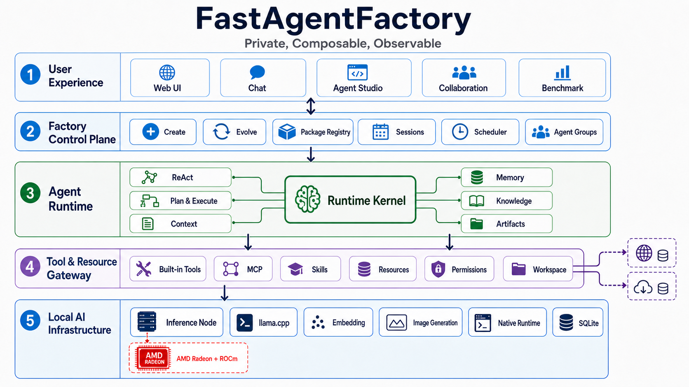

# FastAgentFactory Agent Architecture

## 1. User Experience

The Web application unifies chat, Agent manufacturing and evolution, published Agent management, collaboration, knowledge, model configuration, resource configuration, traces, workspaces, and benchmarks. Normal and collaboration sessions are shown as distinct views over the same persistent runtime model.

## 2. Factory Control Plane

The Factory converts natural-language goals into validated AgentPackages. It assembles package identity, prompts, model bindings, tools, skills, knowledge, resources, memory, context, dependencies, and runtime patterns. Publication requires contract validation and runtime probes; evolution reuses the same package structure instead of maintaining a parallel format.

## 3. Agent Runtime

RuntimeKernel loads an AgentPackage and executes its declared pattern:

- `react_agent` for adaptive tool-use loops.
- `plan_and_execute` for explicit planning, execution, and final synthesis.

The runtime owns sessions, checkpoints, context assembly, compression, cross-session memory, knowledge retrieval, scheduled execution, artifacts, and trace events. The same lifecycle is used by the main personal assistant and published specialist agents.

## 4. Collaboration Scheduler

The main agent searches published specialist agents and creates semantic subtasks. Each subtask receives an isolated session and workspace. The scheduler applies capacity backpressure, initializes package environments idempotently, starts workers, and notifies the main agent when a task is submitted, blocked, or failed. The main agent then reviews artifacts against semantic delivery criteria.

## 5. Tool and Resource Gateway

Built-in tools, MCP servers, skills, package tools, and model tools share a unified execution gateway. The gateway handles schema validation, workspace boundaries, approval policy, encrypted resource injection, output persistence, and audit events. Tools do not bypass runtime ownership by writing directly into shared host state.

## 6. Local AI Infrastructure

The model pool manages chat, embedding, and image-generation profiles. The AMD inference node exposes loopback-only model and control APIs, records real runtime metadata, estimates VRAM capacity, and switches between Official and AMD llama.cpp builds using the same profile.

## Isolation Boundaries

- A package owns its contracts, dependencies, and initialized runtime environment.
- A session owns conversation state, checkpoint state, workspace, and tool output.
- A collaboration task owns a sub-agent session and delivery workspace.
- Resource values are encrypted and released only to authorized package executions.
- Native Agent subprocesses are supervised per package and session, with isolated writable workspaces and content-addressed dependency environments.
- Model services remain on loopback and are reached directly or through SSH tunnels.

The diagram is a submission-oriented architecture view. Source code and runtime contracts remain the authoritative implementation reference.
